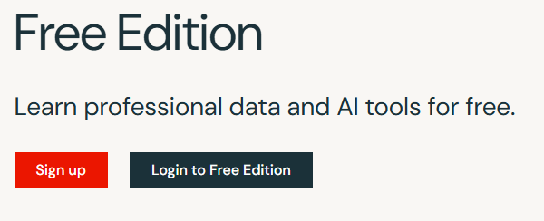
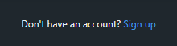
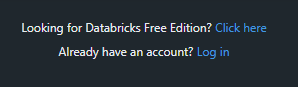
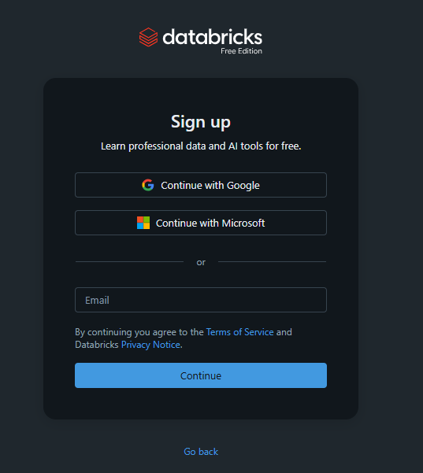
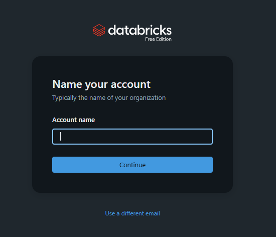
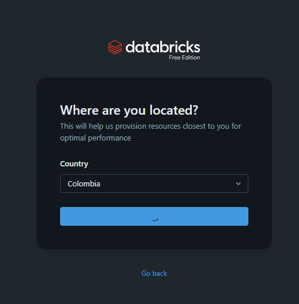
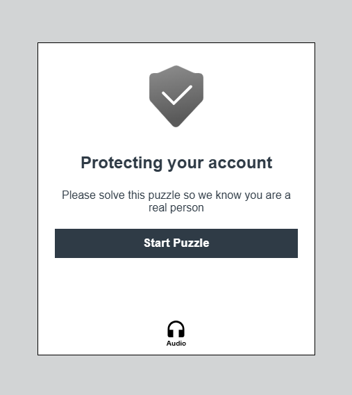
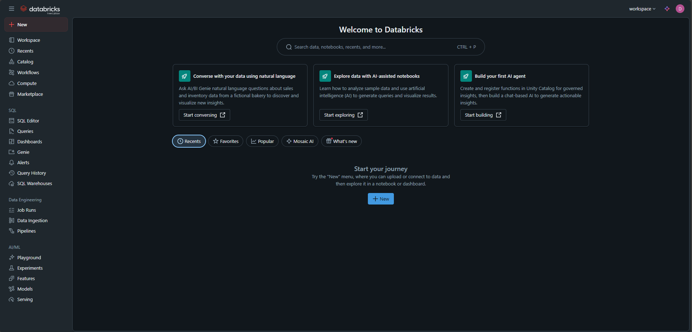

### Workshop Instructions

Welcome to our workshop!

To help you follow along, we’ve prepared a Databricks notebook — an interactive environment for running code and visualizations — to guide you through the workshop.

To access it, you’ll need a Databricks Free Edition account. Below are the instructions to set it up.

1. Access the following link:
    
    https://www.databricks.com/learn/free-edition

2. Click on "Login to Free Edition"

    

3. To sign up for a new account:

    
    
    3.1. Then, in the next window, click on "Looking for Databricks Free Account? Click Here"
    
    

    3.2. Sign up with the email account you prefer

    

    3.3. Name your account:

    

    3.4. Select your country

    

    3.5. Solve the puzzle

    

4. You should have access to databricks now: 
    
    